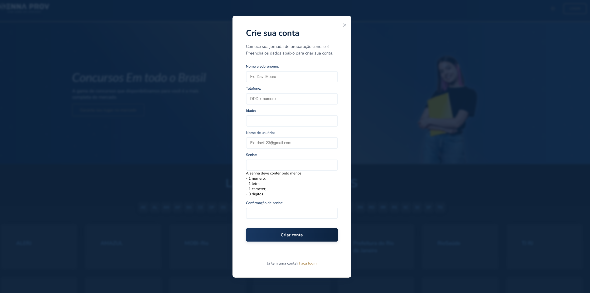
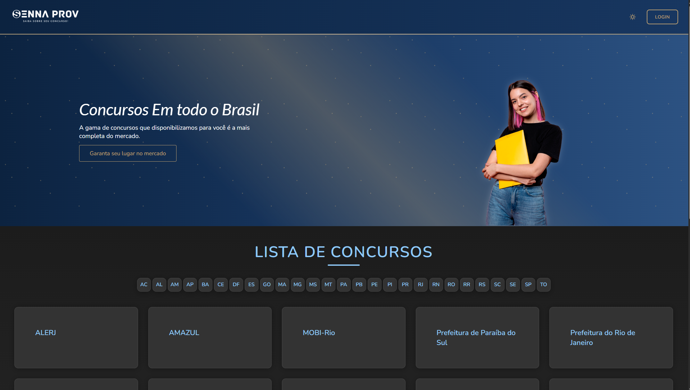
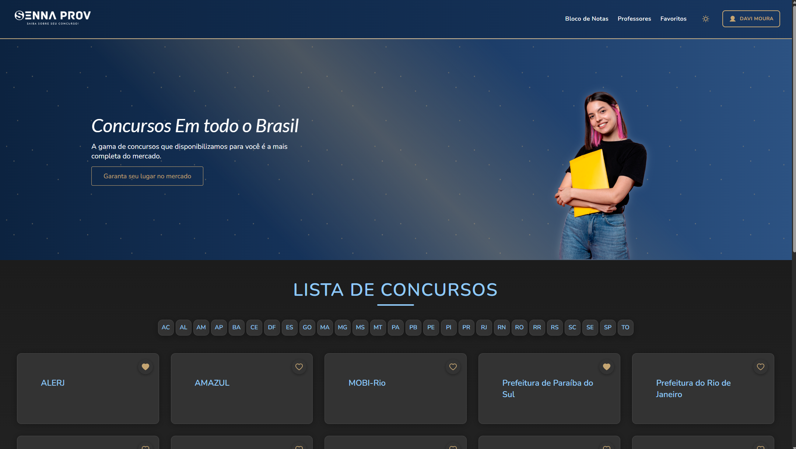
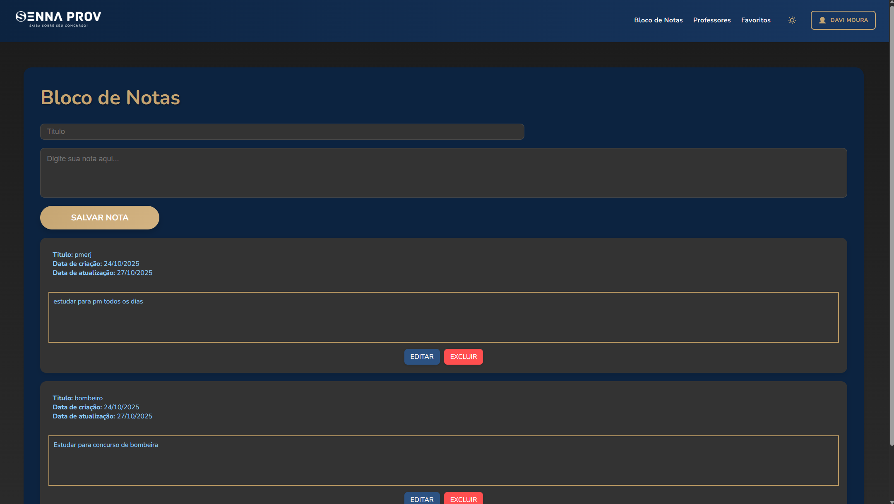
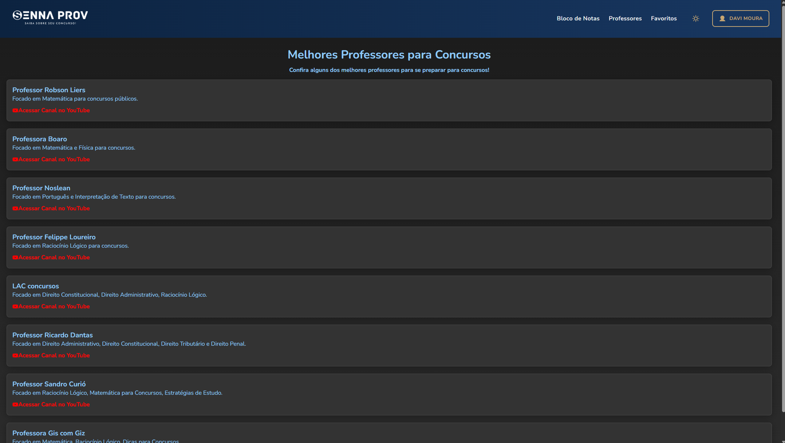
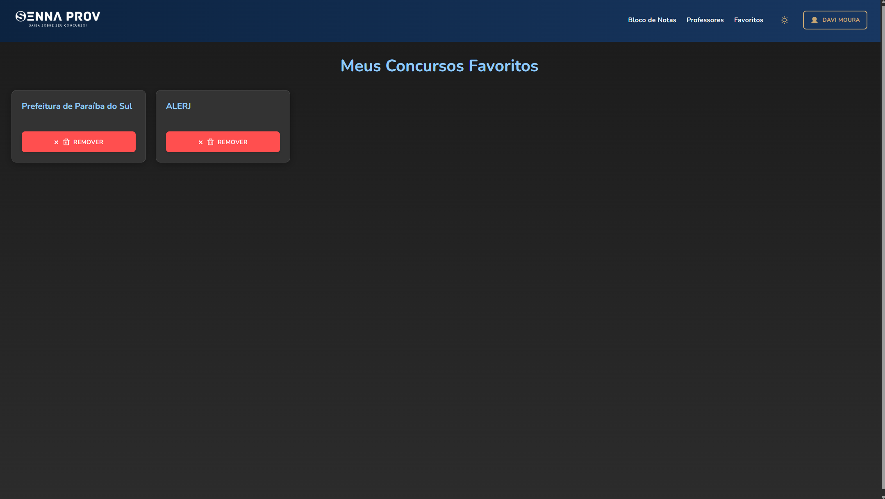
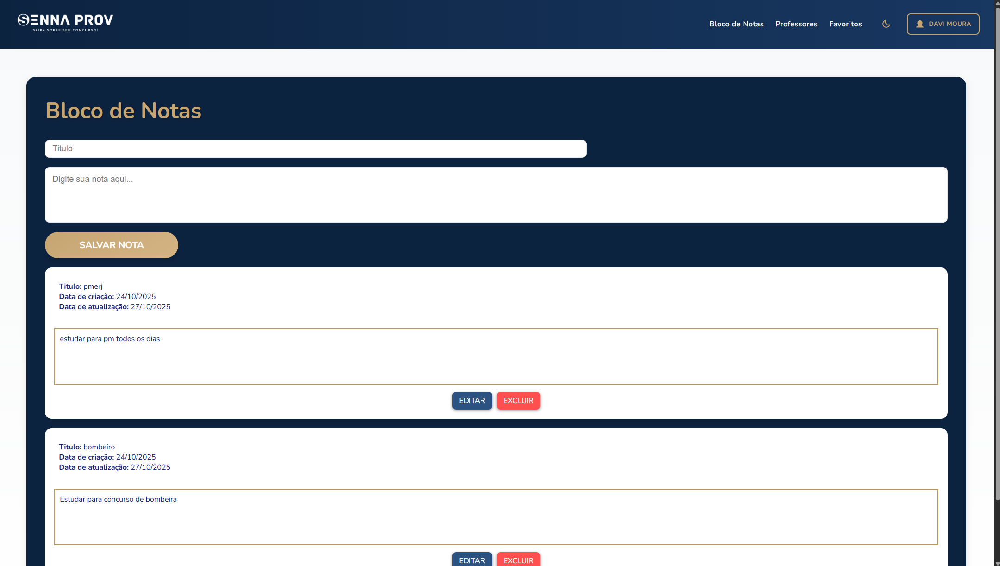
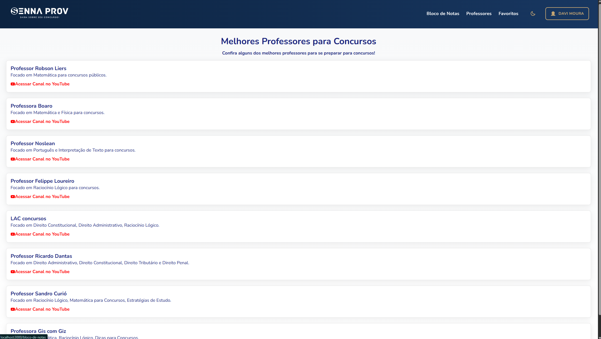
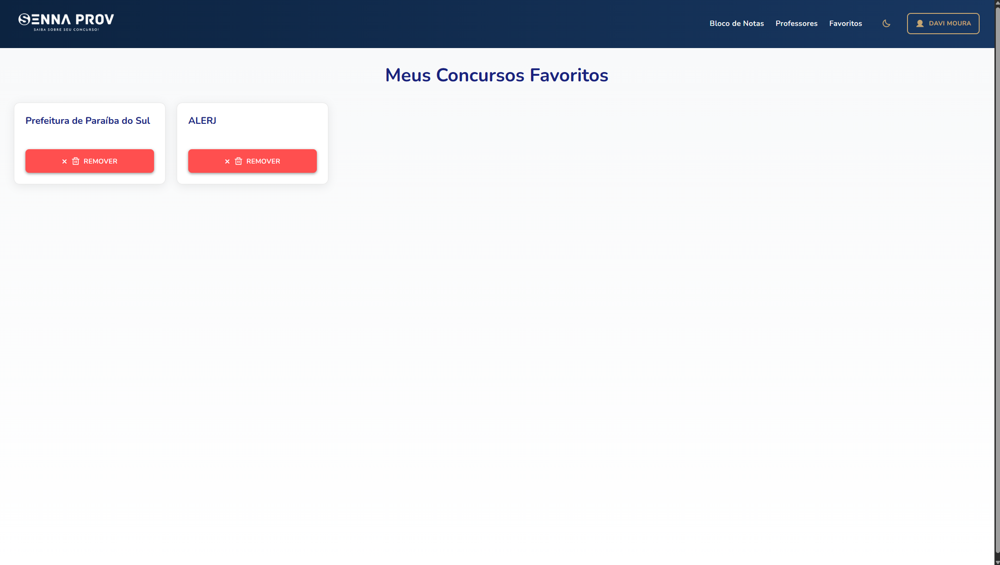

Projeto: SennaProv - concursos publicos

Sobre o Projeto:

Esse projeto foi inicialmente desenvolvido em grupo durante o curso de Desenvolvedor Fullstack, e após um ano, foi totalmente reestruturado por mim para aplicar boas práticas de arquitetura, autenticação e segurança.
O objetivo foi transformar um projeto acadêmico em algo próximo de um sistema real de produção.

Repositorio do projeto anterior:
Front:https://github.com/davimoura27/CursoFullStack-Frontend-Projeto-sennaProv-EmGrupo-React.git
Back:https://github.com/davimoura27/CursoFullStack-backend-Projeto-sennaProv-EmGupo-SpringBoot.git

Tecnologias Utilizadas:

- Frontend: ReactJS  
- Backend: Spring Boot (Java)  
- Banco de Dados: MySQL  
- Autenticação: JWT  
- Web Scraping: Jsoup  

Funcionalidades:

- Login e registro de usuários com validação de senha (Regex)  
- Autenticação e autorização via JWT  
- Gerenciamento de favoritos e bloco de notas por usuário  
- Exibição dinâmica dos concursos por UF  
- Tema claro e escuro  
- Erros personalizados e mensagens amigáveis no frontend  
- Layout responsivo com menu hambúrguer  

Telas do Projeto:

 
Tela de login:

Tela de Cadastro:

Tela inicial:

Tela inicial logado:

Tela de bloco de notas:

Tela de professores:

Tela de concursos favoritos:

Tela com menu hamburguer para telas menores:

Tela inicial logado(Tema claro):

Tela de bloco de notas(Tema claro):

Tela de professores(Tema Claro):

Tela de concursos favoritos(Tema claro):

